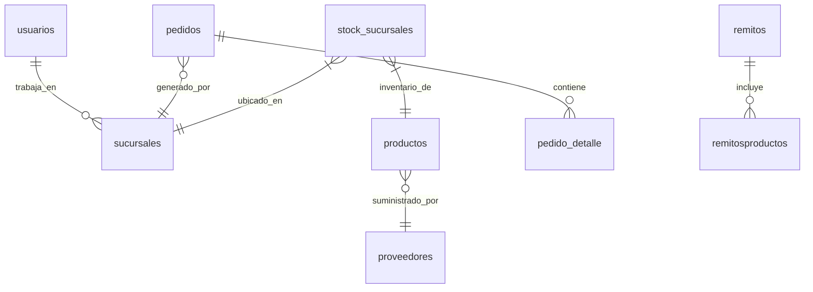

# 📊 Base de Datos: Sistema de Gestión Logística

## 🔑 Tablas Principales

### 👥 `usuarios`
| Campo                | Tipo         | Restricciones                           | Descripción                          |
|----------------------|--------------|-----------------------------------------|--------------------------------------|
| `id_usuario`         | SERIAL       | PRIMARY KEY                             | Identificador único                 |
| `nombre_usuario`     | VARCHAR(100) | NOT NULL                                |                                      |
| `rol`                | VARCHAR(10)  | ENUM('admin', 'empleado')               | Permisos del sistema                |
| `id_sucursal`        | INT          | FOREIGN KEY → `sucursales`              | NULL para administradores           |
| `estado`             | VARCHAR(10)  | ENUM('activo', 'inactivo')              | Control de acceso                   |

**Relaciones**:
- Un usuario puede no tener sucursal asignada (administradores)
- Un empleado pertenece a exactamente 1 sucursal

---

### 🏪 `sucursales`
| Campo          | Tipo         | Restricciones                  | Descripción               |
|----------------|--------------|--------------------------------|---------------------------|
| `id_sucursal`  | SERIAL       | PRIMARY KEY                    |                           |
| `nombre`       | VARCHAR(100) | NOT NULL, UNIQUE               | Ej: "Casa Central"        |
| `estado`       | VARCHAR(10)  | ENUM('activo', 'inactivo')     |                           |

---

### 📦 `productos`
| Campo            | Tipo          | Restricciones                              |
|------------------|---------------|--------------------------------------------|
| `id_producto`    | SERIAL        | PRIMARY KEY                                |
| `nombre`         | VARCHAR(100)  | NOT NULL, UNIQUE                           |
| `precio`         | NUMERIC(10,2) | CHECK (`precio` > 0)                       |
| `id_proveedor`   | INT           | FOREIGN KEY → `proveedores`, NOT NULL      |
| `estado`         | VARCHAR(20)   | ENUM('activo', 'discontinuado', 'en oferta')|

**Reglas**:
- No se puede eliminar si tiene stock en cualquier sucursal
- Precio siempre mayor a cero

---

## 🔗 Tablas de Relación

### 📋 `remitos`
| Campo                   | Tipo        | Descripción                                  |
|-------------------------|-------------|----------------------------------------------|
| `id_remito`            | SERIAL       | PRIMARY KEY                                  |
| `id_sucursal_origen`   | INT          | FOREIGN KEY → `sucursales`                   |
| `id_sucursal_destino`  | INT          | FOREIGN KEY → `sucursales`                   |
| `estado`               | VARCHAR(20)  | ENUM('pendiente','en tránsito','recibido','anulado') |

**Restricciones**:
- Origen y destino deben ser diferentes
- Solo administradores pueden anular remitos

---

### 🧾 `remitosproductos` (Tabla pivote)
| Campo         | Tipo    | Restricciones                     |
|---------------|---------|-----------------------------------|
| `id_remito`   | INT     | COMPOSITE PK, FK → `remitos`      |
| `id_producto` | INT     | COMPOSITE PK, FK → `productos`    |
| `cantidad`    | INT     | CHECK (`cantidad` > 0)            |

---

## 📝 Módulo de Pedidos

### 📨 `pedidos`
| Campo               | Tipo        | Estados posibles                          |
|---------------------|-------------|-------------------------------------------|
| `id_pedido`         | SERIAL      | PRIMARY KEY                               |
| `id_sucursal_origen`| INT         | FOREIGN KEY → `sucursales`                |
| `estado`            | VARCHAR(30) | 'pendiente','aprobado','rechazado','completo' |

**Flujo**:
1. Sucursal crea pedido → estado `pendiente`
2. Admin aprueba → genera remito automático
3. Recepción completa → estado `completo`

---

## 📊 Tablas de Auditoría

### 📜 `historial_cambios`
| Campo               | Tipo         | Ejemplo de registro                     |
|---------------------|--------------|-----------------------------------------|
| `tipo`              | VARCHAR(50)  | "modificacion"                          |
| `entidad_afectada`  | VARCHAR(50)  | "productos"                             |
| `id_entidad`        | INT          | 153 (ID del producto modificado)        |
| `campo`             | VARCHAR(100) | "precio"                                |
| `valor_anterior`    | TEXT         | "299.99"                                |
| `valor_nuevo`       | TEXT         | "349.99"                                |

---

## 📌 Notas Importantes
1. **Integridad referencial**: Todas las relaciones están protegidas con FOREIGN KEYs
2. **Validaciones**:
   - `CHECK (cantidad > 0)` en tablas de detalle
   - `UNIQUE` en campos críticos como nombres de productos
3. **Estados controlados**: Todas las tablas principales tienen campos de estado con ENUMs